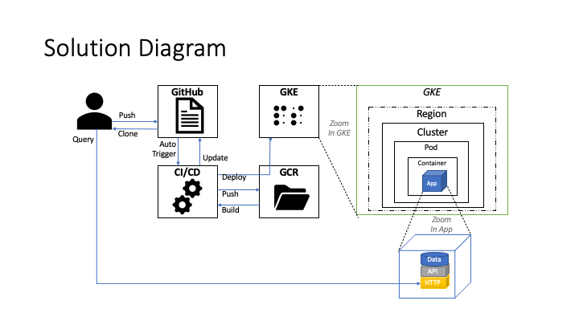

# Go-API

A simple API that help to manage user date of birth records. To do so we use a Goland app and a dummy in-memory 'database'.

## Setup

### Requirements
- Install git, go and docker
- Clone the go-api repositoty

### Preparatiion
$ export GOPATH=<.../\>go-api\
$ cd $GOPATH\
$ go get github.com/gorilla/mux\
$ go get github.com/stretchr/testify/assert\
$ cd src

### Run it manually
$ go build -o ./server .\
$ ./server

### Run it with Docker (locally)
$ docker build -t go-api .\
$ docker run -it --rm -p 9000:9000 go-api 

### Run it with Google Cloud Platform
- Install Google Cloud SDK
- Setup the SDK\
$ gcloud auth login\
$ gcloud config set project [PROJECT_ID]
- Build, store image in GCR and deploy it to a GKE cluster\
$ gcloud builds submit --config build_gcp.yaml .\
... But before running it you may need to edit/update the PROJECT_ID, IMAGE, TAG, LOCATION, CLUSTER values in the build_gcp.yaml to match your GCP setup.

## Test the API

### Add or update a record
$ curl -X PUT http://localhost:9000/hello/<username\> -H "Content-Type: application/json"  -d '{"DateOfBirth": "<YYYY-MM-DD\>"}'

### Get the birthday message
$  curl http://localhost:9000/hello/<username\>

### Get the complete list of records
$  curl http://localhost:9000/hello